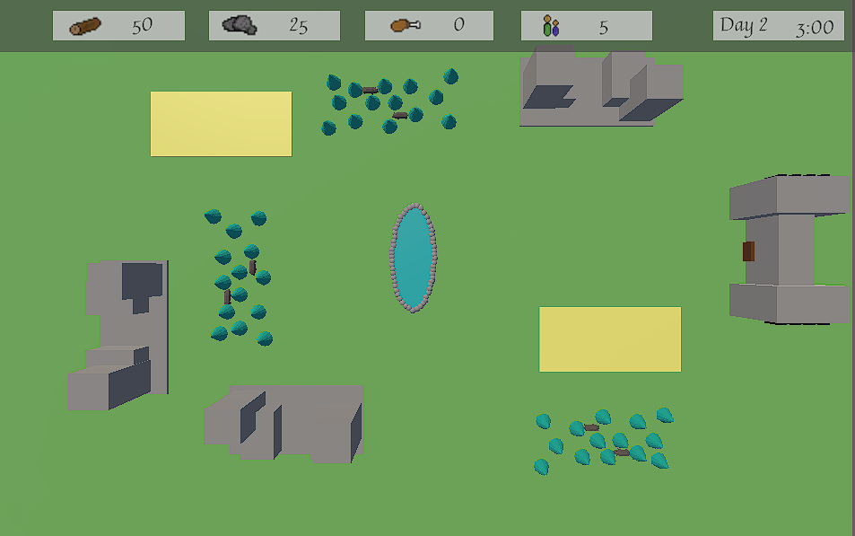
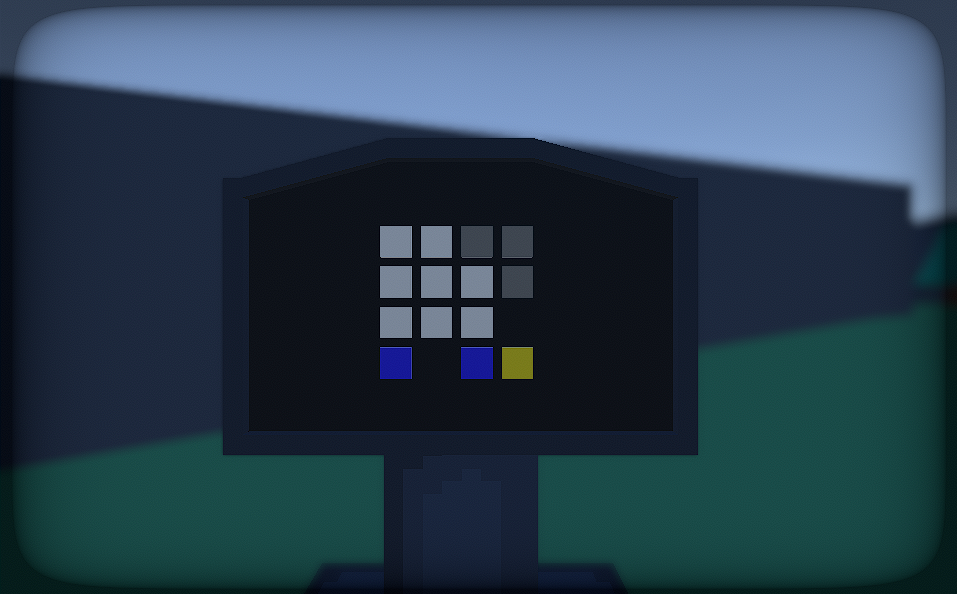
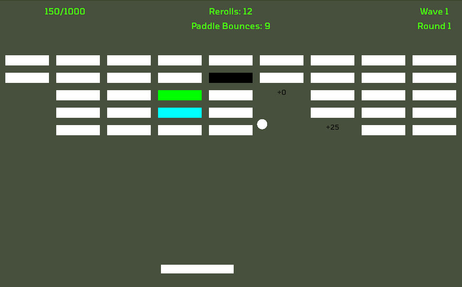
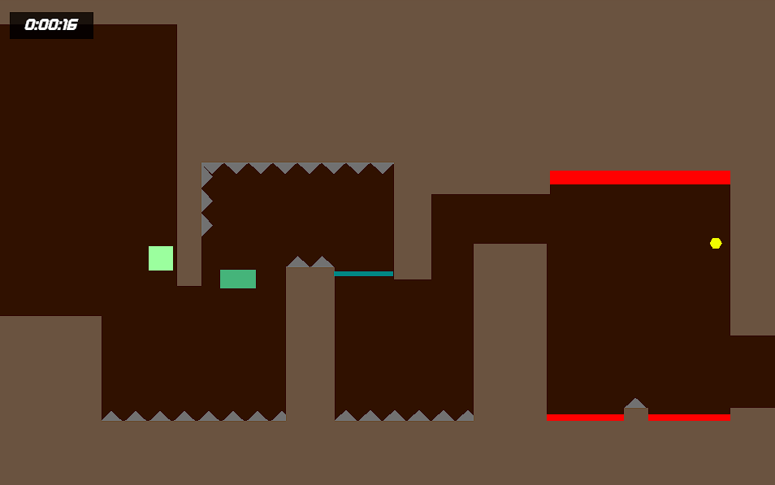
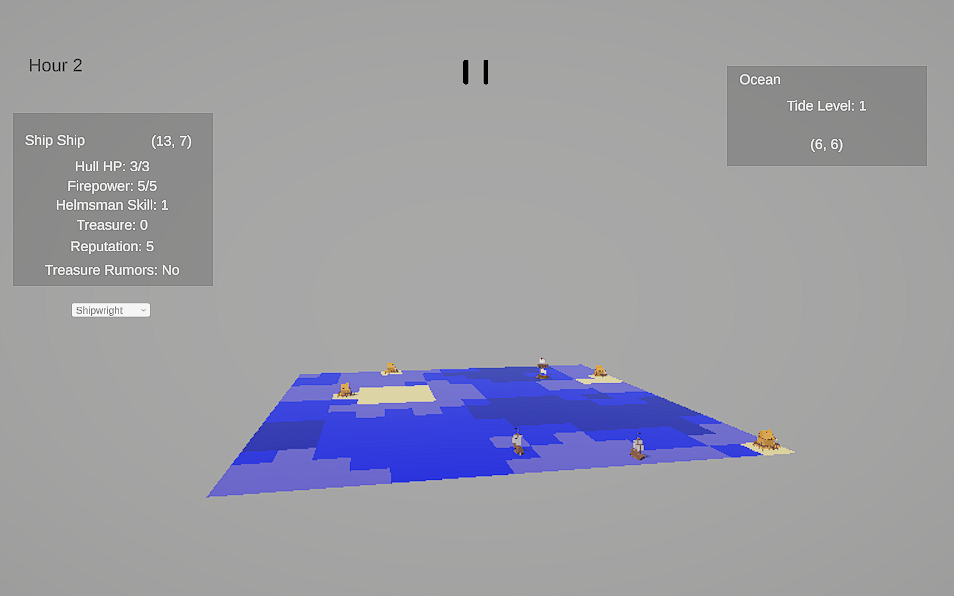
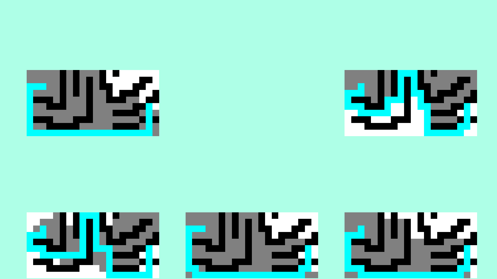

# Game Portfolio

## My game direction

Throughout my process of learning about game development, I have decided to experience multiple genres. Many of the game prototypes in this website came from wanting to try to create fun and interactive mechanics. The following games are gameplay-centric and vary in what I was experimenting with.

## Medieval Survival Game

This is one of my first attempts at creating a more complex game. The goal of the game is to gather resources by allocating your units and trying to keep your people happy. There is time pressure, so there is an element of strategy to it.

[Try Here](https://robjg-1234.github.io/csc470-fall2024/games/units/)
&emsp;

&ensp;

&emsp;

&ensp;

## Puzzle Game

This is a first-person puzzle game where you have to walk around the world and solve puzzles to access the campfire. The main mechanic of this prototype revolves around the idea of grid puzzles that are not directly explained to the player. My aim here was to provide introductory puzzles so that the player could learn by doing.

[Try Here](https://robjg-1234.github.io/csc470-fall2024/games/final/)
&emsp;

&ensp;

&emsp;

&ensp;

## Breakout Roguelike

The idea for this game was to try to implement roguelike elements to breakout. The way I did it is by putting more emphasis on the bricks instead of the actual paddle, which made it into a strategy game. I tried to add variety in the type of bricks you could have to allow different strategies and also provide outside buffs that could also change the approach to building the board.

[Try Here](https://robjg-1234.github.io/game-dev-spring2025/builds/breakout-final/)
&emsp;

&ensp;

&emsp;

&ensp;

## Shield Platformer

A simple 2D platformer where the main mechanic is to use the arrow keys to change the position of your shield so that you can bounce off spikes. There is a significant emphasis on momentum and challenge, which is why there are optional collectibles, and each room has its own checkpoint.

[Try Here](https://robjg-1234.github.io/game-dev-spring2025/builds/platformer-final/)
&emsp;

&ensp;

&emsp;

&ensp;

## Captain Simulator

This prototype is focused on pathfinding. The player is tasked with commanding a pirate ship to success. In it, the player can change the target based on what they believe is relevant, such as distance, health, and firepower. The game utilizes its own A* algorithm to handle how the pathing is done for both the player and the enemies. Additionally, the "water" dynamically changes based on its surroundings.

[Try Here](https://robjg-1234.github.io/game-dev-spring2025/builds/simulation-2/)

&emsp;

&ensp;

&emsp;

&ensp;

## Simple Grid Pathfinding Analyzer

This is not a game, but it's a neat project that compares Breadth-First Search, Depth-First Search, Greedy Search, A*, and a random search. It allows whoever wants to use it to experiment with different layouts and different amounts of objectives for the pathing algorithms to do.

[Try Here](https://robjg-1234.github.io/csc468-final/aibuild/)
&emsp;

&ensp;

&emsp;

&ensp;

